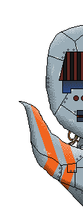

# About MyChatBot:

This app was created using in Python using PyQt6 and OpenAi's Chatbot API.

The goal here is to simply have a chatbot AI you can talk with through with a sufficient gui platform.

### Talking with the ChatBot:

The ChatBot is able to answer most of your questions and able to have a casual talk with you. This means, you will get a correct and friendly answer most of the time but some inaccuracies cam happen.

Simply type in a message like you would do with any other chat application and press enter on your keyboard or click on the "Send" button. The AI will shortly answer you. More complex answer can take up a few seconds.

### Using the source code of this project:

You are free to use this project's source code and modify it within the GPL3 copyright but you will need to register on https://openai.com/ to ger your own API key for this project.
